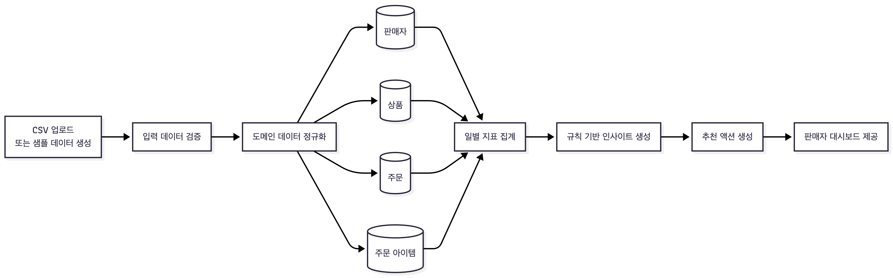
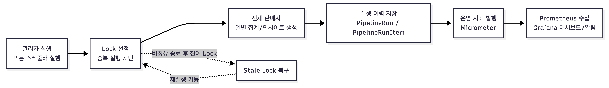
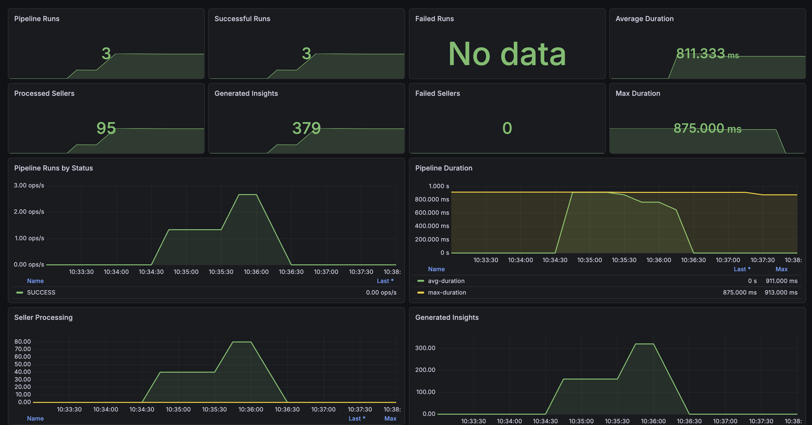

# SellerInsight

SellerInsight는 스마트스토어 판매자가 주문, 상품, 재고 데이터를 기반으로 일별 판매 지표와 운영 인사이트를 확인할 수 있는 커머스 분석 백엔드 서비스입니다.

판매자는 주문 CSV를 업로드해 데이터를 적재하고, 서비스는 이를 `Seller`, `Product`, `CustomerOrder`, `OrderItem` 도메인으로 정규화합니다. 이후 일별 지표를 집계하고 규칙 기반 인사이트와 추천 액션을 생성해 대시보드에서 확인할 수 있습니다. 관리자는 전체 판매자 대상 일별 운영 파이프라인을 실행하고, 실행 이력과 운영 지표를 Prometheus/Grafana에서 관측할 수 있습니다.

## 주요 기능

- 판매자 주문 CSV 업로드 및 적재 작업 상태 추적
- 주문, 상품, 주문 아이템 데이터 정규화
- 판매자별 일별 주문 수, 매출, 평균 주문 금액, 품절 상품, 장기 미판매 상품 집계
- 주문 감소, 품절 위험, 장기 미판매 상품, 평균 주문 금액 감소 인사이트 생성
- 인사이트별 추천 액션 생성
- 판매자 대시보드와 일별 지표 추이 조회
- 전체 판매자 대상 일별 집계/인사이트 운영 파이프라인 실행
- 파이프라인 실행 이력 및 판매자별 처리 결과 조회
- lock table 기반 동일 날짜 파이프라인 중복 실행 방지
- stale lock 자동 복구 및 운영자 강제 lock 해제
- Micrometer, Prometheus, Grafana 기반 파이프라인 운영 지표 모니터링

## 시스템 구성


SellerInsight는 Spring Boot API 서버와 PostgreSQL을 중심으로 동작합니다. 애플리케이션은 CSV 주문 데이터를 정규화하고 일별 지표와 인사이트를 생성합니다. 파이프라인 실행 결과는 Micrometer metric으로 발행되며, Prometheus가 이를 수집하고 Grafana가 대시보드와 알림 규칙으로 시각화합니다.

## 서비스 흐름

### 데이터 처리 파이프라인



CSV 업로드로 유입된 주문 데이터는 입력 검증을 거친 뒤 내부 도메인 모델로 정규화됩니다. 이후 날짜별 지표를 집계하고, 집계 결과를 기반으로 인사이트와 추천 액션을 생성합니다.

### 일별 운영 파이프라인



관리자 실행 또는 스케줄러 실행으로 전체 판매자 대상 일별 파이프라인을 수행합니다. 파이프라인은 `pipeline_type + metric_date` 기준 lock을 선점해 동일 날짜 중복 실행을 차단하고, 판매자별 집계/인사이트 생성을 완료한 뒤 실행 이력과 운영 지표를 남깁니다.

## 기술 스택

- Java 17
- Spring Boot 3.5
- Spring Web, Validation, Security, Data JPA, Actuator
- PostgreSQL, H2 Test DB
- Flyway
- Swagger/OpenAPI
- Micrometer, Prometheus, Grafana, Loki, Alloy
- Docker Compose
- JUnit 5, Spring Boot Test

## 로컬 실행

### 1. 환경 변수 파일 준비

```bash
cp .env.example .env
```

기본 DB 설정:

```text
DB_PORT=5432
DB_NAME=sellerinsight
DB_USERNAME=sellerinsight
DB_PASSWORD=sellerinsight
DB_HOST=postgres
```

로컬 기본 계정:

```text
Admin:  admin / admin-1234
Seller: seller-demo / seller-demo-1234
```

로컬/데모 환경에서는 `seller-demo` 판매자가 Flyway seed migration으로 자동 생성됩니다. Seller 계정은 `APP_SELLER_EXTERNAL_SELLER_ID` 값과 같은 `externalSellerId`를 가진 판매자에 연결됩니다.

### 2. PostgreSQL 실행

```bash
docker compose up -d
```

### 3. Observability stack 실행

```bash
docker compose -f docker-compose.observability.yml up -d
```

### 4. 애플리케이션 실행

```bash
./gradlew bootRun
```

### 5. 테스트 실행

```bash
./gradlew test
```

## 접속 경로

- Swagger UI: `http://localhost:8080/swagger-ui.html`
- Health Check: `http://localhost:8080/api/v1/health`
- Actuator Health: `http://localhost:8080/actuator/health`
- Prometheus: `http://localhost:9090`
- Prometheus Targets: `http://localhost:9090/targets`
- Grafana: `http://localhost:3000`
- Grafana Dashboard: `http://localhost:3000/d/sellerinsight-daily-pipeline/sellerinsight-daily-pipeline`

Grafana 기본 계정:

```text
admin / admin
```

## 계정 및 판매자 모델

SellerInsight는 로컬/데모 환경에서 Basic Auth 기반 계정을 사용합니다.

- Admin 계정은 샘플 데이터 생성, 전체 판매자 대상 일별 파이프라인 실행, 파이프라인 이력 조회, lock 강제 해제 같은 운영 API를 호출합니다.
- Seller 계정은 연결된 판매자 정보를 조회하고, 해당 판매자의 CSV 업로드, 집계, 인사이트, 대시보드 조회 흐름을 검증합니다.
- 현재 인증된 판매자는 `GET /api/v1/sellers/me`로 조회합니다.
- 신규 판매자를 공개 회원가입으로 생성하는 구조가 아니라, 백엔드에 등록된 판매자 계정이 서비스를 이용하는 구조입니다.

## CSV 업로드 흐름

판매자 주문 CSV 파일을 업로드하면 주문 데이터가 정규화되어 저장됩니다.

```text
POST /api/v1/sellers/{sellerId}/import-jobs/orders/csv
Content-Type: multipart/form-data
file: CSV 파일
```

업로드 작업 조회:

```text
GET /api/v1/sellers/{sellerId}/import-jobs/{importJobId}
```

CSV 필수 헤더:

```text
orderNo,orderItemNo,orderedAt,orderStatus,productId,productName,quantity,unitPrice,itemAmount,totalAmount,salePrice,stockQuantity,productStatus
```

CSV 적재 기준:

- `orderNo`가 같으면 기존 주문을 갱신합니다.
- 같은 주문 안에서 `orderItemNo`가 같으면 기존 주문 아이템을 갱신합니다.
- `productId`가 같으면 기존 상품 정보를 갱신합니다.
- 같은 상품이 여러 행에 등장하면 마지막으로 적재된 행의 상품명, 판매가, 재고, 판매 상태가 상품 현재 상태로 반영됩니다.
- 따라서 같은 날짜 데이터를 다시 업로드하면 신규 행은 추가되고, 같은 `orderNo`/`orderItemNo`/`productId`를 가진 행은 갱신됩니다.

CSV 업로드 후 날짜별 집계와 인사이트 생성을 실행합니다.

```text
POST /api/v1/sellers/{sellerId}/daily-metrics/aggregate?date={metricDate}
POST /api/v1/sellers/{sellerId}/insights/generate?date={metricDate}
```

대시보드의 지표 추이는 CSV 원본이 아니라 생성된 `DailyMetric` 데이터를 기준으로 표시됩니다. 7일치 그래프를 확인하려면 각 날짜에 대해 일별 집계를 생성해야 합니다.

## Swagger 검증 플로우

Swagger UI에서 `Authorize` 버튼을 눌러 Basic Auth를 설정합니다.

Seller API:

```text
seller-demo / seller-demo-1234
```

Admin API:

```text
admin / admin-1234
```

### 1. 현재 판매자 조회

```text
GET /api/v1/sellers/me
```

응답의 `id` 값을 이후 `{sellerId}`로 사용합니다.

### 2. CSV 업로드

```text
POST /api/v1/sellers/{sellerId}/import-jobs/orders/csv
```

정상 실행 기준:

```text
status = SUCCESS
totalRowCount > 0
successRowCount = totalRowCount
failedRowCount = 0
```

### 3. 날짜별 일별 지표 집계

```text
POST /api/v1/sellers/{sellerId}/daily-metrics/aggregate?date=2026-04-15
POST /api/v1/sellers/{sellerId}/daily-metrics/aggregate?date=2026-04-16
POST /api/v1/sellers/{sellerId}/daily-metrics/aggregate?date=2026-04-17
POST /api/v1/sellers/{sellerId}/daily-metrics/aggregate?date=2026-04-18
POST /api/v1/sellers/{sellerId}/daily-metrics/aggregate?date=2026-04-19
POST /api/v1/sellers/{sellerId}/daily-metrics/aggregate?date=2026-04-20
POST /api/v1/sellers/{sellerId}/daily-metrics/aggregate?date=2026-04-21
```

### 4. 인사이트 생성

전일 대비 인사이트를 확인하려면 비교 기준이 되는 이전 날짜 지표를 먼저 생성한 뒤 대상 날짜 인사이트를 생성합니다.

```text
POST /api/v1/sellers/{sellerId}/insights/generate?date=2026-04-21
```

### 5. 판매자 대시보드 조회

```text
GET /api/v1/sellers/{sellerId}/dashboard?metricDays=7&insightLimit=5
```

확인 항목:

- 최신 집계일 기준 요약 지표
- 7일 지표 추이
- 최근 인사이트
- 추천 액션

### 6. 인사이트 조회

```text
GET /api/v1/sellers/{sellerId}/insights?date=2026-04-21
```

## 관리자 운영 플로우

### 샘플 데이터 생성

로컬 검증용 데이터를 초기화하고 샘플 데이터를 주입합니다.

```text
POST /api/v1/admin/sample-data/bootstrap?scenario=default
POST /api/v1/admin/sample-data/bootstrap?scenario=large
```

주의: 샘플 데이터 bootstrap은 기존 판매자, 상품, 주문, 지표, 인사이트, 파이프라인 이력을 초기화한 뒤 데이터를 다시 생성합니다.

### 전체 판매자 대상 일별 파이프라인 실행

```text
POST /api/v1/admin/pipelines/daily?date={metricDate}
```

정상 실행 기준:

```text
status = SUCCESS
processedSellerCount = totalSellerCount
failedSellerCount = 0
generatedInsightCount > 0
```

파이프라인 실행 이력 조회:

```text
GET /api/v1/admin/pipelines/daily/runs?limit=5
GET /api/v1/admin/pipelines/daily/runs/{runId}
```

파이프라인 lock 강제 해제:

```text
DELETE /api/v1/admin/pipelines/daily/locks/{metricDate}
```

## 주요 API

| 구분 | Method | Path |
| --- | --- | --- |
| Health | `GET` | `/api/v1/health` |
| Seller | `GET` | `/api/v1/sellers/me` |
| Seller | `GET` | `/api/v1/sellers/{sellerId}` |
| CSV Import | `POST` | `/api/v1/sellers/{sellerId}/import-jobs/orders/csv` |
| CSV Import | `GET` | `/api/v1/sellers/{sellerId}/import-jobs/{importJobId}` |
| Daily Metric | `POST` | `/api/v1/sellers/{sellerId}/daily-metrics/aggregate` |
| Daily Metric | `GET` | `/api/v1/sellers/{sellerId}/daily-metrics/{metricDate}` |
| Insight | `POST` | `/api/v1/sellers/{sellerId}/insights/generate` |
| Insight | `GET` | `/api/v1/sellers/{sellerId}/insights` |
| Insight | `GET` | `/api/v1/sellers/{sellerId}/insights/{insightId}` |
| Dashboard | `GET` | `/api/v1/sellers/{sellerId}/dashboard` |
| Dashboard | `GET` | `/api/v1/sellers/{sellerId}/dashboard/metrics` |
| Dashboard | `GET` | `/api/v1/sellers/{sellerId}/dashboard/insights/recent` |
| Sample Data | `POST` | `/api/v1/admin/sample-data/bootstrap` |
| Pipeline | `POST` | `/api/v1/admin/pipelines/daily` |
| Pipeline | `GET` | `/api/v1/admin/pipelines/daily/runs` |
| Pipeline | `GET` | `/api/v1/admin/pipelines/daily/runs/{runId}` |
| Pipeline Lock | `DELETE` | `/api/v1/admin/pipelines/daily/locks/{metricDate}` |

## 운영 지표

일별 파이프라인 실행 결과는 Micrometer metric으로 발행됩니다.

- `daily.pipeline.runs`
- `daily.pipeline.duration`
- `daily.pipeline.processed.sellers`
- `daily.pipeline.failed.sellers`
- `daily.pipeline.generated.insights`

Prometheus에서는 아래 이름으로 확인할 수 있습니다.

- `daily_pipeline_runs_total`
- `daily_pipeline_duration_seconds_count`
- `daily_pipeline_duration_seconds_sum`
- `daily_pipeline_duration_seconds_max`
- `daily_pipeline_processed_sellers_total`
- `daily_pipeline_failed_sellers_total`
- `daily_pipeline_generated_insights_total`

Grafana dashboard:

```text
SellerInsight Daily Pipeline
```



Alert rule:

- 파이프라인 실패 실행 감지
- 판매자 단위 부분 실패 감지
- 실행 시간 증가 감지

## 트러블슈팅

### Swagger에서 401 또는 403이 발생하는 경우

- Admin API는 `admin / admin-1234` 계정으로 인증합니다.
- Seller API는 `seller-demo / seller-demo-1234` 또는 Admin 계정으로 인증합니다.
- Swagger 우측 상단 `Authorize` 설정을 다시 확인합니다.

### 대시보드 지표 추이가 비어 있는 경우

- CSV 업로드만으로는 지표 추이가 생성되지 않습니다.
- 조회하려는 날짜에 대해 `POST /api/v1/sellers/{sellerId}/daily-metrics/aggregate?date={metricDate}`를 실행했는지 확인합니다.
- 7일치 그래프를 보려면 표시하려는 각 날짜의 `DailyMetric`이 생성되어 있어야 합니다.

### Grafana 대시보드가 비어 있는 경우

- 애플리케이션이 `8080` 포트에서 실행 중인지 확인합니다.
- `http://localhost:8080/actuator/prometheus`가 열리는지 확인합니다.
- Prometheus targets에서 `sellerinsight-app` 상태가 `UP`인지 확인합니다.
- 일별 파이프라인을 한 번 이상 실행했는지 확인합니다.

### 파이프라인 lock 충돌이 발생하는 경우

동일 날짜 파이프라인이 이미 실행 중이거나 stale lock이 남아 있을 수 있습니다.

운영자 강제 해제 API:

```text
DELETE /api/v1/admin/pipelines/daily/locks/{metricDate}
```

### 로컬 DB를 초기화해야 하는 경우

```bash
docker compose down -v
docker compose up -d
```
